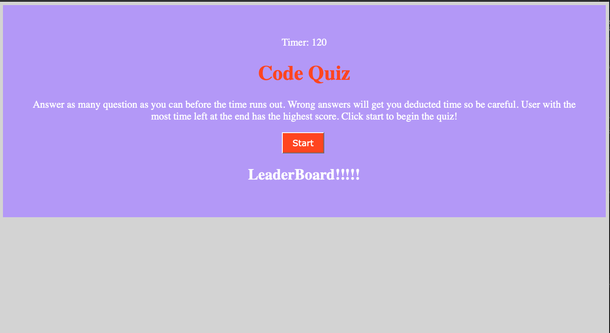

# homework-4

<h2> Code Quiz </h2> 

<h2> Author </h2>

Kendall Masterson

https://github.com/mastersonkl

masterson.kendall@gmail.com

<h2> Description </h2>

This is a simple coding quiz to test your knowledge! You have to race the timer! If you get an answer wrong you will lose time. At the end of the quiz you can enter your name to addd to the leaderboard. 

## Installation Instructions

You can install this program by cloning it to your local machine by running `git clone`.

Here is a photo of the start screen. 

